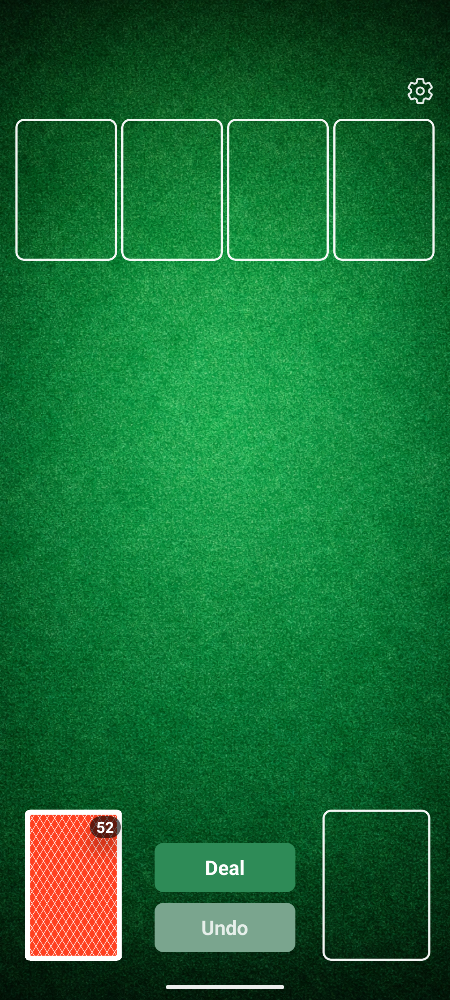
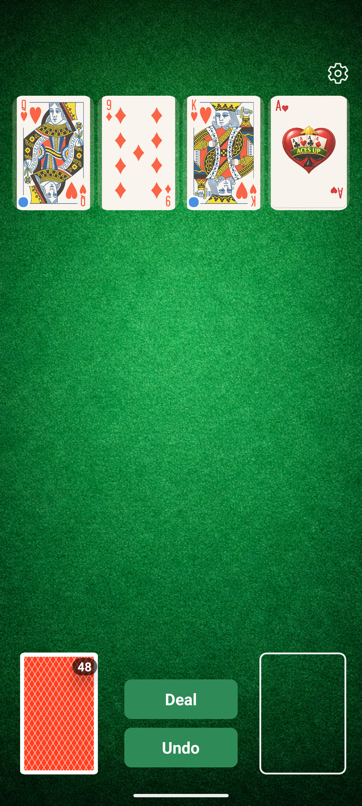
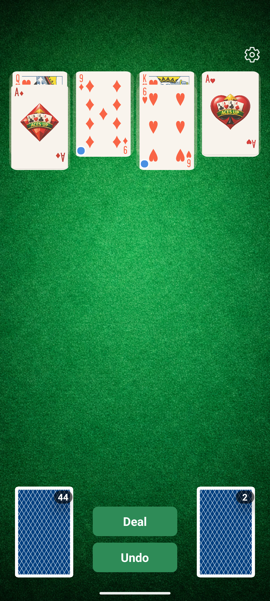
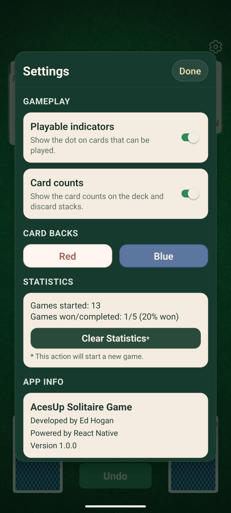
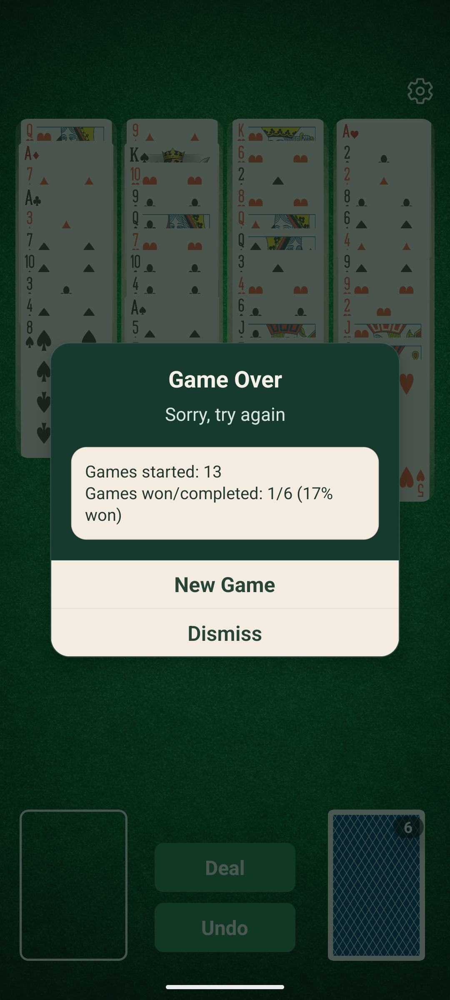

# Aces Up Game

A mobile implementation of **Aces Up (Idiot's Delight)**, powered by [React Native](https://reactnative.dev).

## Project Details

- **Version:** `1.0.0`
- **Developer:** Ed Hogan
- **Framework:** React Native (TypeScript)

## What Is Aces Up?

Aces Up is a single-player card game where the goal is to remove as many cards as possible from the table. The ideal outcome is to finish with only the four aces remaining.

## How The Game Works

1. Four tableau piles are dealt one card each.
2. You can discard a card when another pile shows a higher-ranked card of the same suit.
3. Empty tableau spaces can be filled by moving the top card from another pile.
4. When no more moves are available, deal a new row of four cards.
5. Continue until the deck is exhausted and no legal moves remain.

## Winning

- **Best result:** only the four aces remain.
- Any additional remaining cards are counted as a lower score/result.

## Features

- Classic Aces Up gameplay on mobile
- Card stacks and move validation
- In-app settings and gameplay preferences
- Game stats tracking and summary views
- Unit tests for core components and utilities

## App Screenshots

| New Game                                       | Gameplay                                       | Additional Gameplay                                       | Settings                                       | End Of Game                                       |
| ---------------------------------------------- | ---------------------------------------------- | --------------------------------------------------------- | ---------------------------------------------- | ------------------------------------------------- |
|  |  |  |  |  |

## Tech Stack

- React Native
- TypeScript
- Jest + React Native Testing Library

## Getting Started

> Make sure your machine is set up for React Native development:
> [React Native Environment Setup](https://reactnative.dev/docs/set-up-your-environment)

### Install dependencies

```sh
npm install
```

### iOS only: install CocoaPods dependencies

```sh
bundle install
bundle exec pod install --project-directory=ios
```

### Run Metro

```sh
npm start
```

### Run the app

```sh
# Android
npm run android

# iOS
npm run ios
```

## Test

```sh
npm test
```

## Troubleshooting

- If Metro has stale cache issues, try:

```sh
npm start -- --reset-cache
```

- For React Native platform-specific setup help, see:
  [React Native Troubleshooting](https://reactnative.dev/docs/troubleshooting)

## Notes

This repository contains the source for the Aces Up Game mobile app and is currently released as **version 1.0.0**.
